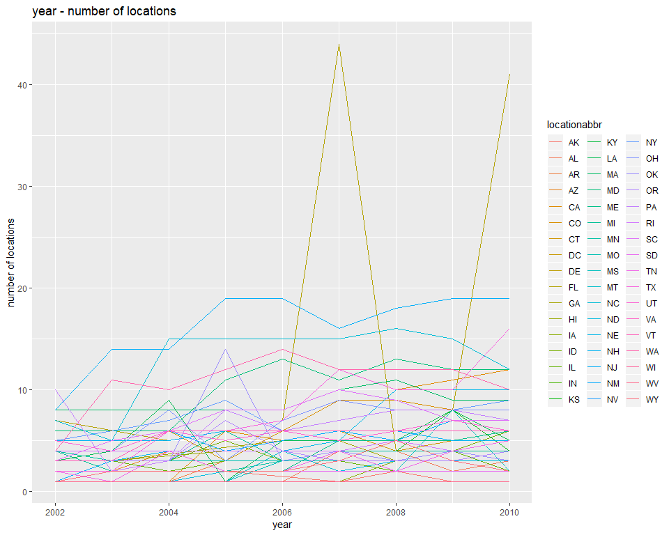

p8105\_hw3\_lz2657
================
Lingyu Zhang
Oct 7, 2018

Problem 1
---------

First, read and manipulate the data as required.

``` r
data("brfss_smart2010")
brfss_data = brfss_smart2010 %>%
  janitor::clean_names() %>%
  filter(topic == "Overall Health") %>%
  filter(response == "Excellent" | response =="Very good" | response == "Good" | response == "Fair" | response =="Poor")
brfss_data$response = factor(brfss_data$response, levels = c("Excellent", "Very good", "Good", "Fair", "Poor"))

brfss_data
```

    ## # A tibble: 10,625 x 23
    ##     year locationabbr locationdesc class topic question response
    ##    <int> <chr>        <chr>        <chr> <chr> <chr>    <fct>   
    ##  1  2010 AL           AL - Jeffer~ Heal~ Over~ How is ~ Excelle~
    ##  2  2010 AL           AL - Jeffer~ Heal~ Over~ How is ~ Very go~
    ##  3  2010 AL           AL - Jeffer~ Heal~ Over~ How is ~ Good    
    ##  4  2010 AL           AL - Jeffer~ Heal~ Over~ How is ~ Fair    
    ##  5  2010 AL           AL - Jeffer~ Heal~ Over~ How is ~ Poor    
    ##  6  2010 AL           AL - Mobile~ Heal~ Over~ How is ~ Excelle~
    ##  7  2010 AL           AL - Mobile~ Heal~ Over~ How is ~ Very go~
    ##  8  2010 AL           AL - Mobile~ Heal~ Over~ How is ~ Good    
    ##  9  2010 AL           AL - Mobile~ Heal~ Over~ How is ~ Fair    
    ## 10  2010 AL           AL - Mobile~ Heal~ Over~ How is ~ Poor    
    ## # ... with 10,615 more rows, and 16 more variables: sample_size <int>,
    ## #   data_value <dbl>, confidence_limit_low <dbl>,
    ## #   confidence_limit_high <dbl>, display_order <int>,
    ## #   data_value_unit <chr>, data_value_type <chr>,
    ## #   data_value_footnote_symbol <chr>, data_value_footnote <chr>,
    ## #   data_source <chr>, class_id <chr>, topic_id <chr>, location_id <chr>,
    ## #   question_id <chr>, respid <chr>, geo_location <chr>

Question 1:

``` r
count_states_2002 = count(count(subset(brfss_data, year == 2002), locationabbr, locationdesc), locationabbr)
filter(count_states_2002, nn == 7)
```

    ## # A tibble: 3 x 2
    ##   locationabbr    nn
    ##   <chr>        <int>
    ## 1 CT               7
    ## 2 FL               7
    ## 3 NC               7

In 2002, only CT, FL and NC were observed at 7 locations.

Question 2:

``` r
count_states_year = count(count(brfss_data, year, locationabbr, locationdesc), year, locationabbr)

ggplot(data = count_states_year, aes(x = year, y = nn, colour = locationabbr)) +
labs(list(title = "year - number of locations", y = paste("number of locations"))) + 
geom_line(size=0.5)
```



Here is the required spaghetti plot and I enlarge the size of it to make it clearer.
