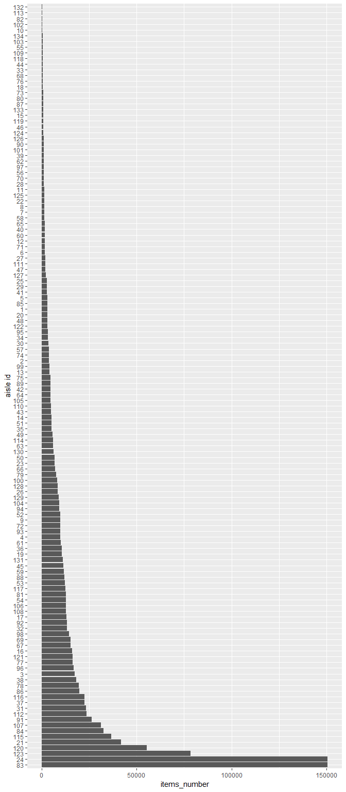

p8105\_hw3\_lz2657
================
Lingyu Zhang
Oct 7, 2018

Problem 1
---------

First, read and manipulate the data as required.

``` r
data("brfss_smart2010")
brfss_data = brfss_smart2010 %>%
  janitor::clean_names() %>%
  filter(topic == "Overall Health") %>%
  filter(response == "Excellent" | response =="Very good" | response == "Good" | response == "Fair" | response =="Poor")
brfss_data$response = factor(brfss_data$response, levels = c("Excellent", "Very good", "Good", "Fair", "Poor"))

brfss_data
```

    ## # A tibble: 10,625 x 23
    ##     year locationabbr locationdesc class topic question response
    ##    <int> <chr>        <chr>        <chr> <chr> <chr>    <fct>   
    ##  1  2010 AL           AL - Jeffer~ Heal~ Over~ How is ~ Excelle~
    ##  2  2010 AL           AL - Jeffer~ Heal~ Over~ How is ~ Very go~
    ##  3  2010 AL           AL - Jeffer~ Heal~ Over~ How is ~ Good    
    ##  4  2010 AL           AL - Jeffer~ Heal~ Over~ How is ~ Fair    
    ##  5  2010 AL           AL - Jeffer~ Heal~ Over~ How is ~ Poor    
    ##  6  2010 AL           AL - Mobile~ Heal~ Over~ How is ~ Excelle~
    ##  7  2010 AL           AL - Mobile~ Heal~ Over~ How is ~ Very go~
    ##  8  2010 AL           AL - Mobile~ Heal~ Over~ How is ~ Good    
    ##  9  2010 AL           AL - Mobile~ Heal~ Over~ How is ~ Fair    
    ## 10  2010 AL           AL - Mobile~ Heal~ Over~ How is ~ Poor    
    ## # ... with 10,615 more rows, and 16 more variables: sample_size <int>,
    ## #   data_value <dbl>, confidence_limit_low <dbl>,
    ## #   confidence_limit_high <dbl>, display_order <int>,
    ## #   data_value_unit <chr>, data_value_type <chr>,
    ## #   data_value_footnote_symbol <chr>, data_value_footnote <chr>,
    ## #   data_source <chr>, class_id <chr>, topic_id <chr>, location_id <chr>,
    ## #   question_id <chr>, respid <chr>, geo_location <chr>

Question 1:

``` r
count_states_2002 = count(count(subset(brfss_data, year == 2002), locationabbr, locationdesc), locationabbr)
filter(count_states_2002, nn == 7)
```

    ## # A tibble: 3 x 2
    ##   locationabbr    nn
    ##   <chr>        <int>
    ## 1 CT               7
    ## 2 FL               7
    ## 3 NC               7

In 2002, only CT, FL and NC were observed at 7 locations.

Question 2:

``` r
count_states_year = count(count(brfss_data, year, locationabbr, locationdesc), year, locationabbr)

ggplot(data = count_states_year, aes(x = year, y = nn, colour = locationabbr)) +
labs(list(title = "year - number of locations", y = paste("number of locations"))) + 
geom_line(size=0.5)
```


Here is the required spaghetti plot and I enlarge the size of it to make it clearer.

Question 3:

``` r
brfss_exclt_prop = subset(brfss_data, locationabbr == "NY" & response == "Excellent" & (year == 2002 | year == 2006 | year == 2010)) %>%
  group_by(year) %>%
  summarize(mean = mean(data_value), sd = sd(data_value))

brfss_exclt_prop
```

    ## # A tibble: 3 x 3
    ##    year  mean    sd
    ##   <int> <dbl> <dbl>
    ## 1  2002  24.0  4.49
    ## 2  2006  22.5  4.00
    ## 3  2010  22.7  3.57

The mean of the proportion of "Excellent" doensn't have large changes while the sd of it was decreasing.

Question 4:

``` r
brfss_prop = brfss_data %>%
  group_by(year, locationabbr, response) %>%
  summarize(mean = mean(data_value))
ggplot(subset(brfss_prop, !is.na(mean)), aes(x = year, y = mean, color = response)) + 
  geom_smooth(se = FALSE) + 
  facet_grid(. ~ response)
```

    ## `geom_smooth()` using method = 'loess' and formula 'y ~ x'


The plot is shown above. The proportion of "Very good" is the highest and that of "Poor" is the lowest. All the proportions of the responses other than "Excellent" were almost unchange. The proportion of "Excellent" had decreased for about 2 percent during the period.

Problem 2
---------

The instacart dataset is a dataframe with 1384617 observations of 15 variables. The variables include order\_id <int>, product\_id <int>, user\_id <int>, order\_dow <int>, order\_hour\_of\_day <int>, aisle <chr> and so on. An example of the observations is 1, 49302, 1, 1, 112108, train, 4, 4, 10, 9, Bulgarian Yogurt, 120, 16, yogurt, dairy eggs, which shows the details of a product from an order.

Question 1:

``` r
n_distinct(instacart_data$aisle_id)
```

    ## [1] 134

``` r
count_aisle_item = instacart_data %>%
  group_by(aisle_id, aisle) %>%
  summarize(items_number = n())
count_aisle_item[which.max(count_aisle_item$items_number),2]
```

    ## # A tibble: 1 x 1
    ##   aisle           
    ##   <chr>           
    ## 1 fresh vegetables

``` r
max(count_aisle_item$items_number)
```

    ## [1] 150609

There are 134 aisles and most items are ordered from fresh vegetables, which has 150609 items.

Question 2:

``` r
ggplot(count_aisle_item, aes(x = reorder(aisle_id, -items_number), y = items_number)) + 
  labs(list(x = "aisle id")) +
  geom_bar(stat = "identity") + 
  coord_flip()
```



The plot is shown above. I use bar plot and rank the aisles to make it more readable. Also, I set the height to 16 and flip the coordinate axes so that the id of the aisles can be distinguished.

Question 3:

``` r
most_pop_item = subset(instacart_data, aisle == "baking ingredients" | aisle == "dog food care" | aisle == "packaged vegetables fruits") %>%
  group_by(aisle, product_name) %>%
  summarize(items_number = n()) %>%
  group_by(aisle) %>%
  filter(max(items_number) == items_number)

most_pop_item
```

    ## # A tibble: 3 x 3
    ## # Groups:   aisle [3]
    ##   aisle                 product_name                          items_number
    ##   <chr>                 <chr>                                        <int>
    ## 1 baking ingredients    Light Brown Sugar                              499
    ## 2 dog food care         Snack Sticks Chicken & Rice Recipe D~           30
    ## 3 packaged vegetables ~ Organic Baby Spinach                          9784

The most popular items in each of the aisles “baking ingredients”, “dog food care”, and “packaged vegetables fruits” are "Light Brown Sugar", "Snack Sticks Chicken & Rice Recipe Dog Treats" and "Organic Baby Spinach", respectively.

Question 4:

``` r
product_mean_hour = subset(instacart_data, product_name == "Pink Lady Apples" | product_name =="Coffee Ice Cream") %>%
  group_by(product_name, order_dow) %>%
  summarize(mean_hour= mean(order_hour_of_day)) %>%
  spread(key = product_name, value = mean_hour)

product_mean_hour
```

    ## # A tibble: 7 x 3
    ##   order_dow `Coffee Ice Cream` `Pink Lady Apples`
    ##       <int>              <dbl>              <dbl>
    ## 1         0               13.8               13.4
    ## 2         1               14.3               11.4
    ## 3         2               15.4               11.7
    ## 4         3               15.3               14.2
    ## 5         4               15.2               11.6
    ## 6         5               12.3               12.8
    ## 7         6               13.8               11.9

Here is the required table. It turns out that the mean hours of Coffee Ice Cream are almost all longer than that of Pink Lady Apples on each day of the week.

Problem 3
---------

The ny\_noaa data is a dataframe with 2595176 observations of 7 variables. The variables include date <date>, prcp <int>, snow <int>, tmax <chr>, tmin<chr> and so on. An example of the observations is USC00300668, 2001-02-08, 64, 127, 762, -22, -94, which shows five core variables for a New York state weather station.
